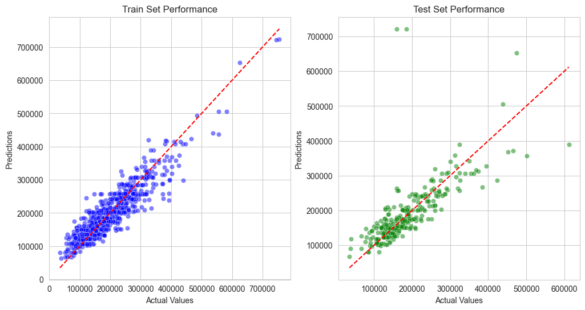

# Heritage House Sale Price Prediction

I have built an app, based on Machine Learning and Data Analysis, to Predict Heritage House Sale Price.
Project is based on Code Institute Milestone options, what helped a lot, and i was supplied with:

* Dataset
* Business Requirements
* And Most Important - Guidance, Information, Teaching and Support, mental support also ;)

>  **Warning**: All Dataframes created by me will be saved/exported as **PARQUET**.

Sad story shortly: do not trust any text style formats, can fail. I was long time wondering what is wrong, now realised, that when saving as csv...
it can save wrong values... Where I had some values now I have NaN. Imagine my frustration when model is not running. I was pulling my hair...

## Dataset Content

* The dataset is sourced from [Kaggle](https://www.kaggle.com/codeinstitute/housing-prices-data). We then created a
  fictitious user story where predictive analytics can be applied in a real project in the workplace.
* The dataset has almost 1.5 thousand rows and represents housing records from Ames, Iowa, indicating house profile (
  Floor Area, Basement, Garage, Kitchen, Lot, Porch, Wood Deck, Year Built) and its respective sale price for houses
  built between 1872 and 2010.

| Variable      | Meaning                                                                 | Units                                                                                                                                                                   |
|:--------------|:------------------------------------------------------------------------|:------------------------------------------------------------------------------------------------------------------------------------------------------------------------|
| 1stFlrSF      | First Floor square feet                                                 | 334 - 4692                                                                                                                                                              |
| 2ndFlrSF      | Second-floor square feet                                                | 0 - 2065                                                                                                                                                                |
| BedroomAbvGr  | Bedrooms above grade (does NOT include basement bedrooms)               | 0 - 8                                                                                                                                                                   |
| BsmtExposure  | Refers to walkout or garden level walls                                 | Gd: Good Exposure; Av: Average Exposure; Mn: Minimum Exposure; No: No Exposure; None: No Basement                                                                       |
| BsmtFinType1  | Rating of basement finished area                                        | GLQ: Good Living Quarters; ALQ: Average Living Quarters; BLQ: Below Average Living Quarters; Rec: Average Rec Room; LwQ: Low Quality; Unf: Unfinshed; None: No Basement |
| BsmtFinSF1    | Type 1 finished square feet                                             | 0 - 5644                                                                                                                                                                |
| BsmtUnfSF     | Unfinished square feet of basement area                                 | 0 - 2336                                                                                                                                                                |
| TotalBsmtSF   | Total square feet of basement area                                      | 0 - 6110                                                                                                                                                                |
| GarageArea    | Size of garage in square feet                                           | 0 - 1418                                                                                                                                                                |
| GarageFinish  | Interior finish of the garage                                           | Fin: Finished; RFn: Rough Finished; Unf: Unfinished; None: No Garage                                                                                                    |
| GarageYrBlt   | Year garage was built                                                   | 1900 - 2010                                                                                                                                                             |
| GrLivArea     | Above grade (ground) living area square feet                            | 334 - 5642                                                                                                                                                              |
| KitchenQual   | Kitchen quality                                                         | Ex: Excellent; Gd: Good; TA: Typical/Average; Fa: Fair; Po: Poor                                                                                                        |
| LotArea       | Lot size in square feet                                                 | 1300 - 215245                                                                                                                                                           |
| LotFrontage   | Linear feet of street connected to property                             | 21 - 313                                                                                                                                                                |
| MasVnrArea    | Masonry veneer area in square feet                                      | 0 - 1600                                                                                                                                                                |
| EnclosedPorch | Enclosed porch area in square feet                                      | 0 - 286                                                                                                                                                                 |
| OpenPorchSF   | Open porch area in square feet                                          | 0 - 547                                                                                                                                                                 |
| OverallCond   | Rates the overall condition of the house                                | 10: Very Excellent; 9: Excellent; 8: Very Good; 7: Good; 6: Above Average; 5: Average; 4: Below Average; 3: Fair; 2: Poor; 1: Very Poor                                 |
| OverallQual   | Rates the overall material and finish of the house                      | 10: Very Excellent; 9: Excellent; 8: Very Good; 7: Good; 6: Above Average; 5: Average; 4: Below Average; 3: Fair; 2: Poor; 1: Very Poor                                 |
| WoodDeckSF    | Wood deck area in square feet                                           | 0 - 736                                                                                                                                                                 |
| YearBuilt     | Original construction date                                              | 1872 - 2010                                                                                                                                                             |
| YearRemodAdd  | Remodel date (same as construction date if no remodelling or additions) | 1950 - 2010                                                                                                                                                             |
| SalePrice     | Sale Price                                                              | 34900 - 755000                                                                                                                                                          |

## Business Requirements

As a good friend, you are requested by your friend, who has received an inheritance from a deceased great-grandfather
located in Ames, Iowa, to help in maximising the sales price for the inherited properties.

Although your friend has an excellent understanding of property prices in her own state and residential area, she fears
that basing her estimates for property worth on her current knowledge might lead to inaccurate appraisals. What makes a
house desirable and valuable where she comes from might not be the same in Ames, Iowa. She found a public dataset with
house prices for Ames, Iowa, and will provide you with that.

* 1 - The client is interested in discovering how the house attributes correlate with the sale price. Therefore, the
  client expects data visualisations of the correlated variables against the sale price to show that.
* 2 - The client is interested in predicting the house sale price from her four inherited houses and any other house in
  Ames, Iowa.

## Data Cleaning

I Processed Data Cleaning in separate Folder, as I have noticed - a lot of missing Information.


I have Broken down all my cleaning and data analysis for missing values in steps:
These steps are located in jupyter_notebooks/data_cleaning
### Floors
1stFlrSF and 2ndFlrSF - 1st and 2nd floors area in square feet

1. Missing values replaced with 0
2. Data Type Type for 2nfFlrSF i have converted to integer (int64)
3. I have found 129 records, where 2nd floor was bigger than 1st. Some of them were way out of my biggest imagination,
   nearly 200% bigger. This let me to Investigating:
* How many of buildings had 2nd floor bigger than ground-floor, result = 0
* What is mean ratio of 2nd and 1st floors living areas for these buildings = 14.76. This is very high.
At first I thought it all would be possible, house was renovated, area increased somehow... But I can not imagine how it is possible to increase by such big difference, and knowing that mean is so high, I came to conclusion: Data was entered wrongly - swapped: 1st floor data was entered to 2nd floor, and 2nd to 1st.
I have swapped values for such buildings.

Later added code to main Cleaning Jupyter notebook, so it could be used as one function to make all data cleaning if required:
```python
# Fill missing values and convert data types
df[['1stFlrSF', '2ndFlrSF']] = df[['1stFlrSF', '2ndFlrSF']].fillna(0).astype(int)

# Swap values where '2ndFlrSF' is greater than '1stFlrSF'
swap_idx = df['2ndFlrSF'] > df['1stFlrSF']
df.loc[swap_idx, ['1stFlrSF', '2ndFlrSF']] = df.loc[swap_idx, ['2ndFlrSF', '1stFlrSF']].values
```
### Bedrooms 
BedroomAbvGr - Bedrooms quantity above grade (ground) quantity
1. I have replaced all missing values with 0
2. I have converted data type from float to integer (int64)
3. Checked how many records are with 0 bedrooms. This is hard to imagine house, even with 2nd floor and no bedrooms. So i checked for average bedroom quantity:
* Houses with 2nd floor mean for bedrooms is 2.43
* Houses with NO 2nd floor mean is 3.03
* For all houses mean is 2.67
I have replaced houses with no bedrooms accordingly:
* No 2nd floor - 2
* with 2nd floor - 3
At the end I have added code to main Cleaning Page:
```python
# Fill missing values, convert types, and update values based on conditions
df['BedroomAbvGr'] = df['BedroomAbvGr'].fillna(0).astype(int)
df.loc[df['2ndFlrSF'] == 0, 'BedroomAbvGr'] = df['BedroomAbvGr'].replace(0, 2)
df.loc[df['2ndFlrSF'] > 0, 'BedroomAbvGr'] = df['BedroomAbvGr'].replace(0, 3)
```
### Basement
* BsmtExposure - Refers to walkouts or garden level walls
* BsmtFinType1 - Rating of basement finished area
* BsmtFinSF1 - Type 1 finished square feet (we believe it is finished basement area)
* BsmtUnfSF - Unfinished square feet of basement area
* TotalBsmtSF - Total square feet of basement area
1. Filled missing values (they were missing just for object data) with "None"
2. Decision was made to inspect how consistent data is:
* If Object Features are "None", all other values should be 0
* If TotalBsmt is 0, all remaining Features should be 0 or None. No total area for basement, all the rest should be nonexistent
Outcome:
* Feature BsmtExposure has 1 inconsistent rows.
* Feature BsmtFinType1 has 108 inconsistent rows.
* Feature BsmtFinSF1 has 430 inconsistent rows.
* Feature BsmtUnfSF has 81 inconsistent rows.
* Feature TotalBsmtSF has 0 inconsistent rows.
Fixing mistakes:
* BsmtExposure - if there is any values in other features, it means there is a basement, i replaced with mean value - "No"
* BsmtFinType1 - if there is any values in other features, it means there is a basement, i replaced with mean value - "Unf"
* Remaining numerical were fixed with common logic (if value is 0):
  * if BsmtUnfSF == 0, we will replace it with TotalBsmtSF - BsmtFinSF1
  * if BsmtFinSF1 == 0, we will replace it with TotalBsmtSF - BsmtUnfSF
  * if totalBsmtSF == 0, we will replace it with BsmtFinSF1 + BsmtUnfSF
Adding code to Cleaning Page:
```python
# Fill missing values for basement exposure and finish type
df['BsmtExposure'] = df['BsmtExposure'].fillna('None')
df['BsmtFinType1'] = df['BsmtFinType1'].fillna('None')

# Define features and their 'no presence' values
basement_features = ['BsmtExposure', 'BsmtFinType1', 'BsmtFinSF1', 'BsmtUnfSF', 'TotalBsmtSF']
features_and_values = {"BsmtExposure": "None", "BsmtFinType1": "None", "BsmtFinSF1": 0, "BsmtUnfSF": 0, "TotalBsmtSF": 0}

# Check and update inconsistencies for each feature
for feature in basement_features:
    primary_value = features_and_values[feature]
    df['Consistency'] = df.apply(
        lambda row: all(row[f] == v for f, v in features_and_values.items()) if row[feature] == primary_value else True,
        axis=1
    )
    inconsistent_idx = df[~df['Consistency']].index
    if feature in ['BsmtExposure', 'BsmtFinType1']:
        correction = 'No' if feature == 'BsmtExposure' else 'Unf'
        df.loc[inconsistent_idx, feature] = correction

# Correct zero values and adjust inconsistent records using vectorized operations
df.loc[df['BsmtUnfSF'] == 0, 'BsmtUnfSF'] = df['TotalBsmtSF'] - df['BsmtFinSF1']
df.loc[df['BsmtFinSF1'] == 0, 'BsmtFinSF1'] = df['TotalBsmtSF'] - df['BsmtUnfSF']
df.loc[df['TotalBsmtSF'] == 0, 'TotalBsmtSF'] = df['BsmtUnfSF'] + df['BsmtFinSF1']

# Identify and adjust records with inconsistent basement measurements using a ratio (example: 3)
mask = df['BsmtFinSF1'] + df['BsmtUnfSF'] != df['TotalBsmtSF']
df.loc[mask, 'BsmtUnfSF'] = (df.loc[mask, 'TotalBsmtSF'] / 3).astype(int)
df.loc[mask, 'BsmtFinSF1'] = df.loc[mask, 'TotalBsmtSF'] - df.loc[mask, 'BsmtUnfSF']
```
### Garages
* GarageArea - Size of garage in square feet
* GarageFinish - Interior Finish of the garage
* GarageYrBlt - Year garage was built
1. Filled missing values:
  * GarageArea and GarageYrBlt with 0
  * GarageFinish with 'None'
2. Consistency checking:
  * Some Garages GarageFinish had 'None', when they had values in GarageArea and GarageYrBlt, we replaced them with mean value of 'Unf'
  * Some Garages in GarageYrBlt had lower values than YearBuilt (house built date), what is wrong, no one builds a garage with no house on the plot. We replaced values of such records with YearBuilt
At the end I have added code to main Cleaning Page:
```python
# Direct assignments to fill missing values and convert data types for garage-related columns
df['GarageArea'] = df['GarageArea'].fillna(0)
df['GarageYrBlt'] = df['GarageYrBlt'].fillna(0).astype(int)
df['GarageFinish'] = df['GarageFinish'].fillna('None')

# Define a dictionary for checking consistency based on 'GarageFinish'
features_and_values = {"GarageArea": 0, "GarageFinish": 'None', "GarageYrBlt": 0}

def check_consistency(df, primary_feature):
    primary_value = features_and_values[primary_feature]
    return df.apply(
        lambda row: all(row[feature] == value for feature, value in features_and_values.items())
        if row[primary_feature] == primary_value else True, axis=1
    )

# Apply consistency check and correct 'GarageFinish'
consistency_mask = check_consistency(df, 'GarageFinish')
df.loc[~consistency_mask, 'GarageFinish'] = 'Unf'

# Correct garage years that are earlier than the house build year
df.loc[df['GarageYrBlt'] < df['YearBuilt'], 'GarageYrBlt'] = df['YearBuilt']
```
### Kitchen
No missing values. all is fine
### Lot and its all features
1. Missing values of LotFrontage we replaced with mean value - 70
2. LotFrontage changed data type from float to integer (int64)
Added code to data cleaning:
```python
df.loc[:, 'LotFrontage'] = df['LotFrontage'].fillna(70)
df['LotFrontage'] = df['LotFrontage'].round().astype(int)
```
### Masonry and Porch
* MasVnrArea - Masonry Veneer area in square feet
* EnclosedPorch - Enclosed porch area in square feet
* OpenPorch - open porch area in square feet
1. Filled missing values MasVnrArea and EnclosedPorch with 0
2. Converted MasVnrArea and EnclosedPorch data types from float to integer (int64)
Added code to data cleaning:
```python
# Fill missing values and immediately convert to integers for specified columns
df['EnclosedPorch'] = df['EnclosedPorch'].fillna(0).astype(int)
df['MasVnrArea'] = df['MasVnrArea'].fillna(0).astype(int)
```
### Condition, Quality, Wood deck
* OverallCond - Rates overall condition of the house
* OverallQual - Rates overall material and finish of the house
* WoodDeskSF - Wood deck area in square feet
1. Filled missing values of WoodDeckSF with 0
2. Converted datatype of WoodDeckSF from float to integer (int64)
Added code to data cleaning:
```python
# Fill missing values and immediately convert to integers for specified columns
df.loc[:, 'WoodDeckSF'] = df['WoodDeckSF'].fillna(value=0)
df['WoodDeckSF'] = df['WoodDeckSF'].astype(int)
```
### Cleaning Outcome
We have done all cleaning and fixing wrong values, to execute all of that we need this code:
```python
df.loc[:, 'LotFrontage'] = df['LotFrontage'].fillna(70)

# Lists of columns grouped by their fill values and type conversions
fill_zero_and_convert = ['1stFlrSF', '2ndFlrSF', 'GarageArea', 'GarageYrBlt',
                         'EnclosedPorch', 'MasVnrArea', 'WoodDeckSF', 'BedroomAbvGr']
fill_none = ['BsmtExposure', 'BsmtFinType1', 'GarageFinish']

# Fill missing values with zero and convert to integers for numerical columns
df[fill_zero_and_convert] = df[fill_zero_and_convert].fillna(0).astype(int)

# Fill missing values with 'None' for categorical columns
df[fill_none] = df[fill_none].fillna('None')
df['LotFrontage'] = df['LotFrontage'].round().astype(int)

df.loc[df['2ndFlrSF'] == 0, 'BedroomAbvGr'] = df['BedroomAbvGr'].replace(0, 2)
df.loc[df['2ndFlrSF'] > 0, 'BedroomAbvGr'] = df['BedroomAbvGr'].replace(0, 3)

# Swap values where '2ndFlrSF' is greater than '1stFlrSF'
swap_idx = df['2ndFlrSF'] > df['1stFlrSF']
df.loc[swap_idx, ['1stFlrSF', '2ndFlrSF']] = df.loc[swap_idx, ['2ndFlrSF', '1stFlrSF']].values

# Define features and their 'no presence' values
basement_features = ['BsmtExposure', 'BsmtFinType1', 'BsmtFinSF1', 'BsmtUnfSF', 'TotalBsmtSF']
features_and_values = {"BsmtExposure": "None", "BsmtFinType1": "None", "BsmtFinSF1": 0, "BsmtUnfSF": 0, "TotalBsmtSF": 0}

# Check and update inconsistencies for each feature
for feature in basement_features:
    primary_value = features_and_values[feature]
    df['Consistency'] = df.apply(
        lambda row: all(row[f] == v for f, v in features_and_values.items()) if row[feature] == primary_value else True,
        axis=1
    )
    inconsistent_idx = df[~df['Consistency']].index
    if feature in ['BsmtExposure', 'BsmtFinType1']:
        correction = 'No' if feature == 'BsmtExposure' else 'Unf'
        df.loc[inconsistent_idx, feature] = correction

# Correct zero values and adjust inconsistent records using vectorized operations
df.loc[df['BsmtUnfSF'] == 0, 'BsmtUnfSF'] = df['TotalBsmtSF'] - df['BsmtFinSF1']
df.loc[df['BsmtFinSF1'] == 0, 'BsmtFinSF1'] = df['TotalBsmtSF'] - df['BsmtUnfSF']
df.loc[df['TotalBsmtSF'] == 0, 'TotalBsmtSF'] = df['BsmtUnfSF'] + df['BsmtFinSF1']

# Identify and adjust records with inconsistent basement measurements using a ratio (example: 3)
mask = df['BsmtFinSF1'] + df['BsmtUnfSF'] != df['TotalBsmtSF']
df.loc[mask, 'BsmtUnfSF'] = (df.loc[mask, 'TotalBsmtSF'] / 3).astype(int)
df.loc[mask, 'BsmtFinSF1'] = df.loc[mask, 'TotalBsmtSF'] - df.loc[mask, 'BsmtUnfSF']

# Define a dictionary for checking consistency based on 'GarageFinish'
features_and_values = {"GarageArea": 0, "GarageFinish": 'None', "GarageYrBlt": 0}

def check_consistency(df, primary_feature):
    primary_value = features_and_values[primary_feature]
    return df.apply(
        lambda row: all(row[feature] == value for feature, value in features_and_values.items())
        if row[primary_feature] == primary_value else True, axis=1
    )

# Apply consistency check and correct 'GarageFinish'
consistency_mask = check_consistency(df, 'GarageFinish')
df.loc[~consistency_mask, 'GarageFinish'] = 'Unf'

# Correct garage years that are earlier than the house build year
df.loc[df['GarageYrBlt'] < df['YearBuilt'], 'GarageYrBlt'] = df['YearBuilt']
```

## Hypothesis
### Hypothesis - 1

We can make summary after Exploring data and its correlations:

* BsmtFinType1 - With Basement Quality increasing, house price tends to increase, although there is some high prices in Unfinished category
* KitchenQual - Kitchen Quality is very clear, with its quality going up, price also goes up.
* OverallQual - Overall Quality is most correlated feature from all, and when it increases, SalePrice also increases
* BsmtExposure - If There is basement in building, With better exposure price tends to increase
* GrLivArea - Increasing Ground Living Area SalePrice also increases
* GarageFinish - Just having garage, price increases, and the more it is Finished, the better house price
* 1stFlrSF - Similar to Ground Living Area, when it goes up, SalePrice also increases
* TotalBsmtSF - By increasing Basement we are increasing SalePrice
* GarageArea - When Garage Area goes up, Sale Price also increase. Most of the houses without garages are 150.000 or less
* YearBuilt - By increasing Garage Year Built we are increasing SalePrice, but it looks more exponential after 1980 ish...

#### Hypothesis 1 Feature Engineering
**Conclusions**
* Ordinal Encoder: ['BsmtFinType1', 'KitchenQual', 'BsmtExposure', 'GarageFinish']
* Numerical transformations:
  * Box Cox: ['GrLivArea', 'YearBuilt', 'SalePrice']
  * Yeo Johnson: ['1stFlrSF', TotalBsmtSF']
  *  'YearBuilt' divide by 1e69
* Original Values: ['OverallQual', 'GarageArea']

#### Hypothesis 1 Model

I believe that model is not good enough, as mean score after testing is just 0.448.
Yes Predictions are not so bad scattered across plot, but i do not like such poor performance.



### Hypothesis 2

After Hypothesis 1 failed with Grand Finale, I believe we need all features to predict prices.


## The rationale to map the business requirements to the Data Visualisations and ML tasks

* List your business requirements and a rationale to map them to the Data Visualisations and ML tasks.

## ML Business Case

* In the previous bullet, you potentially visualised an ML task to answer a business requirement. You should frame the
  business case using the method we covered in the course.

## Dashboard Design

* List all dashboard pages and their content, either blocks of information or widgets, like buttons, checkboxes, images,
  or any other items that your dashboard library supports.
* Eventually, during the project development, you may revisit your dashboard plan to update a given feature (for
  example, at the beginning of the project you were confident you would use a given plot to display an insight, but
  eventually you needed to use another plot type)

## Unfixed Bugs

* You will need to mention unfixed bugs and why they were not fixed. This section should include shortcomings of the
  frameworks or technologies used. Although time can be a big variable to consider, paucity of time and difficulty
  understanding implementation is not valid reason to leave bugs unfixed.

## Deployment

### Heroku

* The App live link is: <https://YOUR_APP_NAME.herokuapp.com/>
* Set the runtime.txt Python version to
  a [Heroku-20](https://devcenter.heroku.com/articles/python-support#supported-runtimes) stack currently supported
  version.
* The project was deployed to Heroku using the following steps.

1. Log in to Heroku and create an App
2. At the Deploy tab, select GitHub as the deployment method.
3. Select your repository name and click Search. Once it is found, click Connect.
4. Select the branch you want to deploy, then click Deploy Branch.
5. The deployment process should happen smoothly if all deployment files are fully functional. Click the button Open App
   on the top of the page to access your App.
6. If the slug size is too large then add large files not required for the app to the .slugignore file.

## Main Data Analysis and Machine Learning Libraries

* Here you should list the libraries you used in the project and provide example(s) of how you used these libraries.

## Credits

* In this section, you need to reference where you got your content, media and extra help from. It is common practice to
  use code from other repositories and tutorials, however, it is important to be very specific about these sources to
  avoid plagiarism.
* You can break the credits section up into Content and Media, depending on what you have included in your project.

### Content

* The text for the Home page was taken from Wikipedia Article A
* Instructions on how to implement form validation on the Sign-Up page was taken
  from [Specific YouTube Tutorial](https://www.youtube.com/)
* The icons in the footer were taken from [Font Awesome](https://fontawesome.com/)

### Media

* The photos used on the home and sign-up page are from This Open Source site
* The images used for the gallery page were taken from this other open-source site

## Acknowledgements (optional)

* In case you would like to thank the people that provided support through this project.


