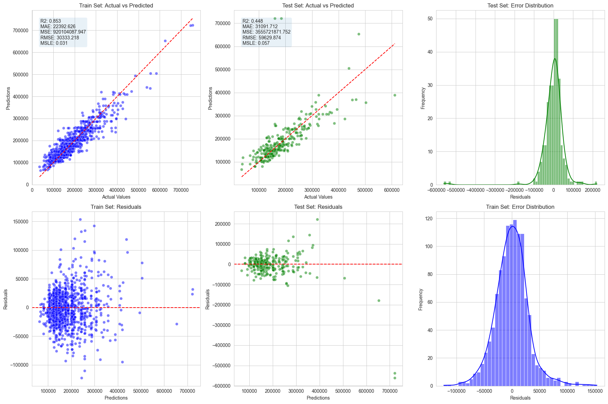
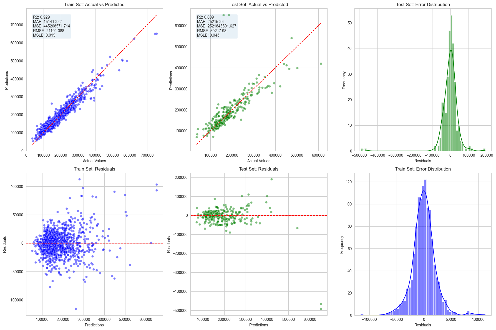

# Heritage House Sale Price Prediction


<!-- TOC -->
* [Heritage House Sale Price Prediction](#heritage-house-sale-price-prediction)
  * [Dataset Content](#dataset-content)
  * [CRISP-DM Methodology](#crisp-dm-methodology)
  * [Business Requirements](#business-requirements)
    * [Business Objectives:](#business-objectives)
    * [Specific Requirements:](#specific-requirements)
  * [Dataset Information](#dataset-information)
  * [Data Cleaning](#data-cleaning)
    * [Floors](#floors)
    * [Bedrooms](#bedrooms)
    * [Basement](#basement)
    * [Garages](#garages)
    * [Kitchen](#kitchen)
    * [Lot and it's all features](#lot-and-its-all-features)
    * [Masonry and Porch](#masonry-and-porch)
    * [Condition, Quality, Wood deck](#condition-quality-wood-deck)
    * [Cleaning Outcome](#cleaning-outcome)
  * [Modeling and evaluation](#modeling-and-evaluation)
    * [Hypothesis 1](#hypothesis-1)
      * [Model Building and Feature Transformations for Hypothesis 1](#model-building-and-feature-transformations-for-hypothesis-1)
    * [Hypothesis 2 - Feature Engineering](#hypothesis-2---feature-engineering)
    * [Hypothesis 3](#hypothesis-3)
      * [Hypothesis 3](#hypothesis-3-1)
      * [Hypothesis 3 Validation](#hypothesis-3-validation)
  * [The rationale to map the business requirements to the Data Visualisations and ML tasks](#the-rationale-to-map-the-business-requirements-to-the-data-visualisations-and-ml-tasks)
    * [New Features (NF) Calculations and Explanations](#new-features-nf-calculations-and-explanations)
    * [Sale Price Prediction](#sale-price-prediction)
  * [Dashboard Design](#dashboard-design)
  * [Unfixed Bugs](#unfixed-bugs)
  * [Deployment](#deployment)
    * [Heroku](#heroku)
  * [Main Data Analysis and Machine Learning Libraries](#main-data-analysis-and-machine-learning-libraries)
    * [Data Profiling and Evaluation](#data-profiling-and-evaluation)
    * [Statistical Analysis](#statistical-analysis)
    * [Data Encoding and Transformation](#data-encoding-and-transformation)
    * [Machine Learning with Scikit-Learn](#machine-learning-with-scikit-learn)
    * [Feature Engineering](#feature-engineering)
    * [Gradient Boosting and Other Regressors](#gradient-boosting-and-other-regressors)
    * [Visualization](#visualization)
  * [Credits](#credits)
  * [Content](#content)
  * [Media](#media)
  * [Acknowledgements (optional)](#acknowledgements-optional)
<!-- TOC -->


I have built an app, based on Machine Learning and Data Analysis, to Predict Heritage House Sale Price.
Project is based on Code Institute Milestone options, what helped a lot, and I was supplied with:

* Dataset
* Business Requirements
* And Most Important - Guidance, Information, Teaching and Support, mental support also ;)

> **Warning**: All Dataframes created by me will be saved/exported as **PARQUET**.

Sad story shortly: do not trust any text style formats, can fail. I was long time wondering what is wrong, now realised,
that when saving as csv...
it can save wrong values... Where I had some values now I have NaN. Imagine my frustration when model is not running. I
was pulling my hair...

## Dataset Content

* The dataset is sourced from [Kaggle](https://www.kaggle.com/codeinstitute/housing-prices-data). We then created a
  fictitious user story where predictive analytics can be applied in a real project in the workplace.
* The dataset has almost 1.5 thousand rows and represents housing records from Ames, Iowa, indicating house profile (
  Floor Area, Basement, Garage, Kitchen, Lot, Porch, Wood Deck, Year Built) and its respective sale price for houses
  built between 1872 and 2010.

| Variable      | Meaning                                                                 | Units                                                                                                                                                                   |
|:--------------|:------------------------------------------------------------------------|:------------------------------------------------------------------------------------------------------------------------------------------------------------------------|
| 1stFlrSF      | First Floor square feet                                                 | 334 - 4692                                                                                                                                                              |
| 2ndFlrSF      | Second-floor square feet                                                | 0 - 2065                                                                                                                                                                |
| BedroomAbvGr  | Bedrooms above grade (does NOT include basement bedrooms)               | 0 - 8                                                                                                                                                                   |
| BsmtExposure  | Refers to walkout or garden level walls                                 | Gd: Good Exposure; Av: Average Exposure; Mn: Minimum Exposure; No: No Exposure; None: No Basement                                                                       |
| BsmtFinType1  | Rating of basement finished area                                        | GLQ: Good Living Quarters; ALQ: Average Living Quarters; BLQ: Below Average Living Quarters; Rec: Average Rec Room; LwQ: Low Quality; Unf: Unfinshed; None: No Basement |
| BsmtFinSF1    | Type 1 finished square feet                                             | 0 - 5644                                                                                                                                                                |
| BsmtUnfSF     | Unfinished square feet of basement area                                 | 0 - 2336                                                                                                                                                                |
| TotalBsmtSF   | Total square feet of basement area                                      | 0 - 6110                                                                                                                                                                |
| GarageArea    | Size of garage in square feet                                           | 0 - 1418                                                                                                                                                                |
| GarageFinish  | Interior finish of the garage                                           | Fin: Finished; RFn: Rough Finished; Unf: Unfinished; None: No Garage                                                                                                    |
| GarageYrBlt   | Year garage was built                                                   | 1900 - 2010                                                                                                                                                             |
| GrLivArea     | Above grade (ground) living area square feet                            | 334 - 5642                                                                                                                                                              |
| KitchenQual   | Kitchen quality                                                         | Ex: Excellent; Gd: Good; TA: Typical/Average; Fa: Fair; Po: Poor                                                                                                        |
| LotArea       | Lot size in square feet                                                 | 1300 - 215245                                                                                                                                                           |
| LotFrontage   | Linear feet of street connected to property                             | 21 - 313                                                                                                                                                                |
| MasVnrArea    | Masonry veneer area in square feet                                      | 0 - 1600                                                                                                                                                                |
| EnclosedPorch | Enclosed porch area in square feet                                      | 0 - 286                                                                                                                                                                 |
| OpenPorchSF   | Open porch area in square feet                                          | 0 - 547                                                                                                                                                                 |
| OverallCond   | Rates the overall condition of the house                                | 10: Very Excellent; 9: Excellent; 8: Very Good; 7: Good; 6: Above Average; 5: Average; 4: Below Average; 3: Fair; 2: Poor; 1: Very Poor                                 |
| OverallQual   | Rates the overall material and finish of the house                      | 10: Very Excellent; 9: Excellent; 8: Very Good; 7: Good; 6: Above Average; 5: Average; 4: Below Average; 3: Fair; 2: Poor; 1: Very Poor                                 |
| WoodDeckSF    | Wood deck area in square feet                                           | 0 - 736                                                                                                                                                                 |
| YearBuilt     | Original construction date                                              | 1872 - 2010                                                                                                                                                             |
| YearRemodAdd  | Remodel date (same as construction date if no remodelling or additions) | 1950 - 2010                                                                                                                                                             |
| SalePrice     | Sale Price                                                              | 34900 - 755000                                                                                                                                                          |

## CRISP-DM Methodology

CRISP-DM (Cross-Industry Standard Process for Data Mining) is a widely-used methodology that provides a structured
approach to planning and executing data mining and machine learning projects. The methodology is divided into six
phases:

1. [Business Understanding](#business-requirements)
2. [Data Understanding](#dataset-information)
3. [Data Preparation](#data-cleaning)
4. [Modeling and Evaluation](#modeling-and-evaluation)
5. [Business Requirements](#business-requirements)
6. [Deployment](#deployment)


## Business Requirements

I was requested by a local heritage society to assist in maximizing the preservation and restoration value of historical
houses located in **Iowa**. The society aims to ensure that these culturally significant properties are well-preserved
and their historical value is accurately appraised.

While the heritage society has a deep understanding of historical architecture and the significance of these properties,
they lack the expertise to predict restoration costs and potential historical value accurately. To aid in this, they
have provided a public dataset containing various attributes and estimated values of historical houses in **Iowa**.

### Business Objectives:

1. **Understanding House Attributes and Historical Value:**

- The society is interested in discovering how different attributes of historical houses correlate with their estimated
  historical value.
- They expect data visualizations to clearly depict the relationship between house attributes (e.g., building size,
  features, age, condition) and their historical value.

2. **Predicting Restoration Costs and Historical Value:**

- The society wants to predict the potential historical value for several historical houses, including their own
  properties and other significant houses in **Iowa**.
- These predictions will help determine their value and guide decisions about the buildings' future.

### Specific Requirements:

- **Data Visualization:**
    - Create visualizations that illustrate the correlation between various house attributes and their historical value.
    - Use scatter plots, bar charts, and heatmaps to provide clear insights into these relationships.

- **Predictive Modeling:**
    - Develop machine learning models to predict the historical value based on the attributes of the houses.
    - Ensure the models are trained and validated on the provided dataset to achieve high accuracy and reliability.

## Dataset Information

The dataset includes the following attributes:

- **1stFlrSF:** First floor square feet (334 - 4692)
- **2ndFlrSF:** Second floor square feet (0 - 2065)
- **BedroomAbvGr:** Bedrooms above grade (0 - 8)
- **BsmtExposure:** Refers to walkout or garden level walls (Gd: Good Exposure; Av: Average Exposure; Mn: Minimum
  Exposure; No: No Exposure; None: No Basement)
- **BsmtFinType1:** Rating of basement finished area (GLQ: Good Living Quarters; ALQ: Average Living Quarters; BLQ:
  Below Average Living Quarters; Rec: Average Rec Room; LwQ: Low Quality; Unf: Unfinished; None: No Basement)
- **BsmtFinSF1:** Type 1 finished square feet (0 - 5644)
- **BsmtUnfSF:** Unfinished square feet of basement area (0 - 2336)
- **TotalBsmtSF:** Total square feet of basement area (0 - 6110)
- **GarageArea:** Size of garage in square feet (0 - 1418)
- **GarageFinish:** Interior finish of the garage (Fin: Finished; RFn: Rough Finished; Unf: Unfinished; None: No Garage)
- **GarageYrBlt:** Year garage was built (1900 - 2010)
- **GrLivArea:** Above grade (ground) living area square feet (334 - 5642)
- **KitchenQual:** Kitchen quality (Ex: Excellent; Gd: Good; TA: Typical/Average; Fa: Fair; Po: Poor)
- **LotArea:** Lot size in square feet (1300 - 215245)
- **LotFrontage:** Linear feet of street connected to property (21 - 313)
- **MasVnrArea:** Masonry veneer area in square feet (0 - 1600)
- **EnclosedPorch:** Enclosed porch area in square feet (0 - 286)
- **OpenPorchSF:** Open porch area in square feet (0 - 547)
- **OverallCond:** Rates the overall condition of the house (10: Very Excellent; 9: Excellent; 8: Very Good; 7: Good; 6:
  Above Average; 5: Average; 4: Below Average; 3: Fair; 2: Poor; 1: Very Poor)
- **OverallQual:** Rates the overall material and finish of the house (10: Very Excellent; 9: Excellent; 8: Very Good;
  7: Good; 6: Above Average; 5: Average; 4: Below Average; 3: Fair; 2: Poor; 1: Very Poor)
- **WoodDeckSF:** Wood deck area in square feet (0 - 736)
- **YearBuilt:** Original construction date (1872 - 2010)
- **YearRemodAdd:** Remodel date (same as construction date if no remodeling or additions) (1950 - 2010)
- **SalePrice:** Sale price (34900 - 755000)

By following these business requirements, the heritage society and I aim to make informed decisions about the
preservation and restoration of historical houses, ensuring their cultural significance is maintained for future
generations.

## Data Cleaning

I Processed Data Cleaning in separate Folder, as I have noticed - a lot of missing Information.


I have Broken down all my cleaning and data analysis for missing values in steps:
These steps are located in jupyter_notebooks/data_cleaning

### Floors

1stFlrSF and 2ndFlrSF - 1st and 2nd floors area in square feet

1. Missing values replaced with 0
2. Data Type Type for 2nfFlrSF i have converted to integer (int64)
3. I have found 129 records, where 2nd floor was bigger than 1st. Some of them were way out of my biggest imagination,
   nearly 200% bigger. This let me to Investigating:

* How many of buildings had 2nd floor bigger than ground-floor, result = 0
* What is mean ratio of 2nd and 1st floors living areas for these buildings = 14.76. This is very high.
  At first, I thought it all would be possible, house was renovated, area increased somehow... But I can not imagine how
  it is possible to increase by such big difference, and knowing that mean is so high, I came to conclusion: Data was
  entered wrongly - swapped: 1st floor data was entered to 2nd floor, and 2nd to 1st.
  I have swapped values for such buildings.

Later added code to main Cleaning Jupyter notebook, so it could be used as one function to make all data cleaning if
required:

```python
# Fill missing values and convert data types
df[['1stFlrSF', '2ndFlrSF']] = df[['1stFlrSF', '2ndFlrSF']].fillna(0).astype(int)

# Swap values where '2ndFlrSF' is greater than '1stFlrSF'
swap_idx = df['2ndFlrSF'] > df['1stFlrSF']
df.loc[swap_idx, ['1stFlrSF', '2ndFlrSF']] = df.loc[swap_idx, ['2ndFlrSF', '1stFlrSF']].values
```

### Bedrooms

BedroomAbvGr - Bedrooms quantity above grade (ground) quantity

1. I have replaced all missing values with 0
2. I have converted data type from float to integer (int64)
3. Checked how many records are with 0 bedrooms. This is hard to imagine house, even with 2nd floor and no bedrooms. So
   I checked for average bedroom quantity:

* Houses with 2nd floor mean for bedrooms is 2.43
* Houses with NO 2nd floor mean is 3.03
* For all houses mean is 2.67
  I have replaced houses with no bedrooms accordingly:
* No 2nd floor - 2
* with 2nd floor - 3
  At the end I have added code to main Cleaning Page:

```python
# Fill missing values, convert types, and update values based on conditions
df['BedroomAbvGr'] = df['BedroomAbvGr'].fillna(0).astype(int)
df.loc[df['2ndFlrSF'] == 0, 'BedroomAbvGr'] = df['BedroomAbvGr'].replace(0, 2)
df.loc[df['2ndFlrSF'] > 0, 'BedroomAbvGr'] = df['BedroomAbvGr'].replace(0, 3)
```

### Basement

* BsmtExposure - Refers to walkouts or garden level walls
* BsmtFinType1 - Rating of basement finished area
* BsmtFinSF1 - Type 1 finished square feet (we believe it is finished basement area)
* BsmtUnfSF - Unfinished square feet of basement area
* TotalBsmtSF - Total square feet of basement area

1. Filled missing values (they were missing just for object data) with "None"
2. Decision was made to inspect how consistent data is:

* If Object Features are "None", all other values should be 0
* If TotalBsmt is 0, all remaining Features should be 0 or None. No total area for basement, all the rest should be
  nonexistent
  Outcome:
* Feature BsmtExposure has 1 inconsistent rows.
* Feature BsmtFinType1 has 108 inconsistent rows.
* Feature BsmtFinSF1 has 430 inconsistent rows.
* Feature BsmtUnfSF has 81 inconsistent rows.
* Feature TotalBsmtSF has 0 inconsistent rows.
  Fixing mistakes:
* BsmtExposure - if there is any values in other features, it means there is a basement, I replaced with mean value - "
  No"
* BsmtFinType1 - if there is any values in other features, it means there is a basement, I replaced with mean value - "
  Unf"
* Remaining numerical were fixed with common logic (if value is 0):
    * if BsmtUnfSF == 0, we will replace it with TotalBsmtSF - BsmtFinSF1
    * if BsmtFinSF1 == 0, we will replace it with TotalBsmtSF - BsmtUnfSF
    * if totalBsmtSF == 0, we will replace it with BsmtFinSF1 + BsmtUnfSF
      Adding code to Cleaning Page:

```python
# Fill missing values for basement exposure and finish type
df['BsmtExposure'] = df['BsmtExposure'].fillna('None')
df['BsmtFinType1'] = df['BsmtFinType1'].fillna('None')

# Define features and their 'no presence' values
basement_features = ['BsmtExposure', 'BsmtFinType1', 'BsmtFinSF1', 'BsmtUnfSF', 'TotalBsmtSF']
features_and_values = {"BsmtExposure": "None", "BsmtFinType1": "None", "BsmtFinSF1": 0, "BsmtUnfSF": 0,
                       "TotalBsmtSF": 0}

# Check and update inconsistencies for each feature
for feature in basement_features:
    primary_value = features_and_values[feature]
    df['Consistency'] = df.apply(
        lambda row: all(row[f] == v for f, v in features_and_values.items()) if row[feature] == primary_value else True,
        axis=1
    )
    inconsistent_idx = df[~df['Consistency']].index
    if feature in ['BsmtExposure', 'BsmtFinType1']:
        correction = 'No' if feature == 'BsmtExposure' else 'Unf'
        df.loc[inconsistent_idx, feature] = correction

# Correct zero values and adjust inconsistent records using vectorized operations
df.loc[df['BsmtUnfSF'] == 0, 'BsmtUnfSF'] = df['TotalBsmtSF'] - df['BsmtFinSF1']
df.loc[df['BsmtFinSF1'] == 0, 'BsmtFinSF1'] = df['TotalBsmtSF'] - df['BsmtUnfSF']
df.loc[df['TotalBsmtSF'] == 0, 'TotalBsmtSF'] = df['BsmtUnfSF'] + df['BsmtFinSF1']

# Identify and adjust records with inconsistent basement measurements using a ratio (example: 3)
mask = df['BsmtFinSF1'] + df['BsmtUnfSF'] != df['TotalBsmtSF']
df.loc[mask, 'BsmtUnfSF'] = (df.loc[mask, 'TotalBsmtSF'] / 3).astype(int)
df.loc[mask, 'BsmtFinSF1'] = df.loc[mask, 'TotalBsmtSF'] - df.loc[mask, 'BsmtUnfSF']
```

### Garages

* GarageArea - Size of garage in square feet
* GarageFinish - Interior Finish of the garage
* GarageYrBlt - Year garage was built

1. Filled missing values:

* GarageArea and GarageYrBlt with 0
* GarageFinish with 'None'

2. Consistency checking:

* Some Garages GarageFinish had 'None', when they had values in GarageArea and GarageYrBlt, we replaced them with mean
  value of 'Unf'
* Some Garages in GarageYrBlt had lower values than YearBuilt (house built date), what is wrong, no one builds a garage
  with no house on the plot. We replaced values of such records with YearBuilt
  At the end I have added code to main Cleaning Page:

```python
# Direct assignments to fill missing values and convert data types for garage-related columns
df['GarageArea'] = df['GarageArea'].fillna(0)
df['GarageYrBlt'] = df['GarageYrBlt'].fillna(0).astype(int)
df['GarageFinish'] = df['GarageFinish'].fillna('None')

# Define a dictionary for checking consistency based on 'GarageFinish'
features_and_values = {"GarageArea": 0, "GarageFinish": 'None', "GarageYrBlt": 0}


def check_consistency(df, primary_feature):
    primary_value = features_and_values[primary_feature]
    return df.apply(
        lambda row: all(row[feature] == value for feature, value in features_and_values.items())
        if row[primary_feature] == primary_value else True, axis=1
    )


# Apply consistency check and correct 'GarageFinish'
consistency_mask = check_consistency(df, 'GarageFinish')
df.loc[~consistency_mask, 'GarageFinish'] = 'Unf'

# Correct garage years that are earlier than the house build year
df.loc[df['GarageYrBlt'] < df['YearBuilt'], 'GarageYrBlt'] = df['YearBuilt']
```

### Kitchen

No missing values. all is fine

### Lot and it's all features

1. Missing values of LotFrontage we replaced with mean value - 70
2. LotFrontage changed data type from float to integer (int64)
   Added code to data cleaning:

```python
df.loc[:, 'LotFrontage'] = df['LotFrontage'].fillna(70)
df['LotFrontage'] = df['LotFrontage'].round().astype(int)
```

### Masonry and Porch

* MasVnrArea - Masonry Veneer area in square feet
* EnclosedPorch - Enclosed porch area in square feet
* OpenPorch - open porch area in square feet

1. Filled missing values MasVnrArea and EnclosedPorch with 0
2. Converted MasVnrArea and EnclosedPorch data types from float to integer (int64)
   Added code to data cleaning:

```python
# Fill missing values and immediately convert to integers for specified columns
df['EnclosedPorch'] = df['EnclosedPorch'].fillna(0).astype(int)
df['MasVnrArea'] = df['MasVnrArea'].fillna(0).astype(int)
```

### Condition, Quality, Wood deck

* OverallCond - Rates overall condition of the house
* OverallQual - Rates overall material and finish of the house
* WoodDeskSF - Wood deck area in square feet

1. Filled missing values of WoodDeckSF with 0
2. Converted datatype of WoodDeckSF from float to integer (int64)
   Added code to data cleaning:

```python
# Fill missing values and immediately convert to integers for specified columns
df.loc[:, 'WoodDeckSF'] = df['WoodDeckSF'].fillna(value=0)
df['WoodDeckSF'] = df['WoodDeckSF'].astype(int)
```

### Cleaning Outcome

We have done all cleaning and fixing wrong values, to execute all of that we need this code:

```python
df.loc[:, 'LotFrontage'] = df['LotFrontage'].fillna(70)

# Lists of columns grouped by their fill values and type conversions
fill_zero_and_convert = ['1stFlrSF', '2ndFlrSF', 'GarageArea', 'GarageYrBlt',
                         'EnclosedPorch', 'MasVnrArea', 'WoodDeckSF', 'BedroomAbvGr']
fill_none = ['BsmtExposure', 'BsmtFinType1', 'GarageFinish']

# Fill missing values with zero and convert to integers for numerical columns
df[fill_zero_and_convert] = df[fill_zero_and_convert].fillna(0).astype(int)

# Fill missing values with 'None' for categorical columns
df[fill_none] = df[fill_none].fillna('None')
df['LotFrontage'] = df['LotFrontage'].round().astype(int)

df.loc[df['2ndFlrSF'] == 0, 'BedroomAbvGr'] = df['BedroomAbvGr'].replace(0, 2)
df.loc[df['2ndFlrSF'] > 0, 'BedroomAbvGr'] = df['BedroomAbvGr'].replace(0, 3)

# Swap values where '2ndFlrSF' is greater than '1stFlrSF'
swap_idx = df['2ndFlrSF'] > df['1stFlrSF']
df.loc[swap_idx, ['1stFlrSF', '2ndFlrSF']] = df.loc[swap_idx, ['2ndFlrSF', '1stFlrSF']].values

# Define features and their 'no presence' values
basement_features = ['BsmtExposure', 'BsmtFinType1', 'BsmtFinSF1', 'BsmtUnfSF', 'TotalBsmtSF']
features_and_values = {"BsmtExposure": "None", "BsmtFinType1": "None", "BsmtFinSF1": 0, "BsmtUnfSF": 0,
                       "TotalBsmtSF": 0}

# Check and update inconsistencies for each feature
for feature in basement_features:
    primary_value = features_and_values[feature]
    df['Consistency'] = df.apply(
        lambda row: all(row[f] == v for f, v in features_and_values.items()) if row[feature] == primary_value else True,
        axis=1
    )
    inconsistent_idx = df[~df['Consistency']].index
    if feature in ['BsmtExposure', 'BsmtFinType1']:
        correction = 'No' if feature == 'BsmtExposure' else 'Unf'
        df.loc[inconsistent_idx, feature] = correction

# Correct zero values and adjust inconsistent records using vectorized operations
df.loc[df['BsmtUnfSF'] == 0, 'BsmtUnfSF'] = df['TotalBsmtSF'] - df['BsmtFinSF1']
df.loc[df['BsmtFinSF1'] == 0, 'BsmtFinSF1'] = df['TotalBsmtSF'] - df['BsmtUnfSF']
df.loc[df['TotalBsmtSF'] == 0, 'TotalBsmtSF'] = df['BsmtUnfSF'] + df['BsmtFinSF1']

# Identify and adjust records with inconsistent basement measurements using a ratio (example: 3)
mask = df['BsmtFinSF1'] + df['BsmtUnfSF'] != df['TotalBsmtSF']
df.loc[mask, 'BsmtUnfSF'] = (df.loc[mask, 'TotalBsmtSF'] / 3).astype(int)
df.loc[mask, 'BsmtFinSF1'] = df.loc[mask, 'TotalBsmtSF'] - df.loc[mask, 'BsmtUnfSF']

# Define a dictionary for checking consistency based on 'GarageFinish'
features_and_values = {"GarageArea": 0, "GarageFinish": 'None', "GarageYrBlt": 0}


def check_consistency(df, primary_feature):
    primary_value = features_and_values[primary_feature]
    return df.apply(
        lambda row: all(row[feature] == value for feature, value in features_and_values.items())
        if row[primary_feature] == primary_value else True, axis=1
    )


# Apply consistency check and correct 'GarageFinish'
consistency_mask = check_consistency(df, 'GarageFinish')
df.loc[~consistency_mask, 'GarageFinish'] = 'Unf'

# Correct garage years that are earlier than the house build year
df.loc[df['GarageYrBlt'] < df['YearBuilt'], 'GarageYrBlt'] = df['YearBuilt']
```

## Modeling and evaluation

### Hypothesis 1

After exploring the dataset, I have arrived at the following conclusions:

- **BsmtFinType1:** As basement quality increases, house price tends to rise, although some high prices are found in the
  unfinished category.
- **KitchenQual:** Kitchen quality has a clear impact; as its quality improves, the price also increases.
- **OverallQual:** This is the most correlated feature with SalePrice. Higher overall quality leads to higher sale
  prices.
- **BsmtExposure:** Houses with basements and better exposure tend to have higher prices.
- **GrLivArea:** Increasing ground living area results in higher sale prices.
- **GarageFinish:** Having a garage increases the price, and the more finished the garage, the higher the price.
- **1stFlrSF:** Similar to ground living area, as the first floor square footage increases, the SalePrice also rises.
- **TotalBsmtSF:** Larger basement areas contribute to higher SalePrices.
- **GarageArea:** A larger garage area is associated with higher sale prices. Most houses without garages are priced at
  $150,000 or less.
- **YearBuilt:** Newer houses, particularly those built after 1980, show an exponential increase in SalePrice.

Summary of data exploration and correlations:


#### Model Building and Feature Transformations for Hypothesis 1

I built a model using the following features and transformations:

- **Ordinal Encoder:** `['BsmtFinType1', 'KitchenQual', 'BsmtExposure', 'GarageFinish']`
- **Numerical Transformations:**
    - **Box Cox:** `['GrLivArea', 'YearBuilt']`
    - **Yeo Johnson:** `['1stFlrSF', 'TotalBsmtSF']`
    - **YearBuilt:** Divided by 1e69
- **Original Values:** `['OverallQual', 'GarageArea']`

**Outcome:**
After building model and selecting the best regressor GradientBoostRegressor, Model showed that our Hypothesis is not
accurate enough (R<sup>2</sup> = 0.448). The scatter plot indicates that while it is possible to predict building value,
several properties are spread across the plot, suggesting more nuances in pricing. All features might be needed to
determine the real potential value of a building.



### Hypothesis 2 - Feature Engineering

I believe that to accurately determine a building's value, all features must be considered. Based on this, I built a
model using the following features and transformations:

- **Yeo Johnson Transformation:
  ** `['1stFlrSF', '2ndFlrSF', 'BedroomAbvGr', 'BsmtExposure', 'BsmtFinType1', 'GarageFinish', 'LotArea', 'MasVnrArea', 'OpenPorchSF', 'OverallQual', 'TotalBsmtSF']`
- **Log Transformation:** `['GarageYrBlt', 'GrLivArea', 'YearBuilt', 'YearRemodAdd']`
- **Box Cox Transformation:** `['LotFrontage', 'OverallCond']`
- **Power Transformation:** `['BsmtFinSF1', 'BsmtUnfSF', 'KitchenQual']`
- **Discard Features:** `['EnclosedPorch', 'WoodDeckSF']`

**Outcome:**

This model performed slightly better (R<sup>2</sup>= 0.609), but still not satisfactorily enough. While the model can
predict building prices, some properties remain scattered on the plot, suggesting that building price depends not just
on individual features but also on how they interact with each other (e.g., garage size and quality, basement size and
finish type, building size and material quality, and overall condition).



### Hypothesis 3

*Further details of Hypothesis 3 will be added here once the analysis is complete.*

#### Hypothesis 3

We need to find more patterns in given data.
I believe it is possible to create new features (NF) from exsisting features in given dataset and model can be built
based on them.

#### Hypothesis 3 Validation

After exploring New features, we have got a bit more insight in dataset.
Result has improved to 0.843 and it VALIDATES our hypothesis 3


This model was based on these Features:


NF - means New Features, they are based on exsisting ones:

* NF_TotalLivingArea Sum of all areas (GrLivArea + 1stFlrSF + 2ndFlrSF)
* NF_TotalLivingArea_mul_OverallQual = NF_TotalLivingArea multiplied by OverallQual
* NF_TotalLivingArea_mul_OverallCond = NF_TotalLivingArea multiplied by OverallCond
* NF_1stFlrSF_mul_OverallQual = 1stFlrSF multiplied by OverallQual,

## The rationale to map the business requirements to the Data Visualisations and ML tasks

### New Features (NF) Calculations and Explanations

1. **NF_TotalLivingArea**:

- **Calculation**:
  ```markdown
  NF_TotalLivingArea = GrLivArea + 1stFlrSF + 2ndFlrSF
  ```
- **Explanation**: This feature represents the total living area of the house by summing the ground living area (
  GrLivArea), the first-floor area (1stFlrSF), and the second-floor area (2ndFlrSF). This provides a comprehensive
  measure of the house's total living space, which is likely to be a significant factor in determining its sale price.

2. **NF_TotalLivingArea_mul_OverallQual**:

- **Calculation**:
  ```markdown
  NF_TotalLivingArea_mul_OverallQual = NF_TotalLivingArea * OverallQual
  ```
- **Explanation**: This feature is calculated by multiplying the total living area (NF_TotalLivingArea) by the overall
  quality of the house (OverallQual). This helps to incorporate the quality of the living space into the model, as
  higher quality construction and finishes typically increase the value of the house.

3. **NF_TotalLivingArea_mul_OverallCond**:

- **Calculation**:
  ```markdown
  NF_TotalLivingArea_mul_OverallCond = NF_TotalLivingArea * OverallCond
  ```
- **Explanation**: This feature is calculated by multiplying the total living area (NF_TotalLivingArea) by the overall
  condition of the house (OverallCond). This allows the model to account for the condition of the living space, with
  better condition typically leading to a higher sale price.

4. **NF_1stFlrSF_mul_OverallQual**:

- **Calculation**:
  ```markdown
  NF_1stFlrSF_mul_OverallQual = 1stFlrSF * OverallQual
  ```
- **Explanation**: This feature is calculated by multiplying the first-floor square feet (1stFlrSF) by the overall
  quality of the house (OverallQual). This emphasizes the importance of the quality of the main living area on the first
  floor, which can significantly impact the house's overall value.

Selected Features and their Correlation to Sale Price


Selected Features distribution against Sale Price


### Sale Price Prediction

As Requested by customer, our prices prediction are these:

| YearBuilt | GarageYrBlt | LotArea | 1stFlrSF | 2ndFlrSF | GrLivArea | OverallQual | OverallCond | SalePrice |
|----------:|------------:|--------:|---------:|---------:|----------:|------------:|------------:|----------:|
|      1961 |        1961 |   11622 |      896 |        0 |       896 |           5 |           6 |    124293 |
|      1958 |        1958 |   14267 |     1329 |        0 |      1329 |           6 |           6 |    162743 |
|      1997 |        1997 |   13830 |      928 |      701 |      1629 |           5 |           5 |    170909 |
|      1998 |        1998 |    9978 |      926 |      678 |      1604 |           6 |           6 |    187232 |

## Dashboard Design

* Project Summary - Short summary for this Project and Business Requirements
* Features and Correlations - Displaying and explaining on what features model was built:
    * Creation of New Features
    * Displaying Correlation of used features for model with SalePrice
    * Displaying distribution of all used features against SalePrice
    * Explanation why certain features were selected
* Target Predictions:
    * This page automatically calculates on input data changes
    * Displays Predicted Price for 1 building based on input
* Hypothesis and Validation:
    * Explaining how New Features were created
    * Displaying selected Features Correlations
    * Displaying Validation information - scores for Test Set
* ML Model - This page is based on pipeline, automatically loads dataset, validates and displays results
* Bulk Predictions:
    * When page loads automatically calculates and displays Inherited houses input dataset and output dataset
    * User can select external CSV and upload, results will be displayed

## Unfixed Bugs

* Still trying to understand PEP formating for Jupyter Notebooks. In examples and training Lessons I was presented with
  functions which were starting in capital letters, what is against PEP styling. Did my best to use all lower case
  functions
* Can not display HistGradientBoosting Regressor Feature Importance - it does not support features selection and does
  not want to be a good friend to coef_
* Grammar needs improving
* Styling of App layout and visualisations - always struggle with any type of styling

## Deployment

### Heroku

* The App live link is: <https://heritage-houses-ce5e2ad82147.herokuapp.com>
* Set the runtime.txt Python version to
  a [Heroku-20](https://devcenter.heroku.com/articles/python-support#supported-runtimes) stack currently supported
  version.
* The project was deployed to Heroku using the following steps.

1. Log in to Heroku and create an App
2. At the Deployment tab, select GitHub as the deployment method.
3. Select your repository name and click Search. Once it is found, click Connect.
4. Select the main branch, then click Deploy Branch.
5. If Slug is too big, I personally recommend muting part of requirements.txt (just add # in front of it). In this case
   I muted all requirements except:

```python
pandas == 1.5.3
matplotlib == 3.8.4
scikit - learn == 1.5.0
numpy == 1.26.4
fastparquet == 2024.5.0
feature - engine == 1.6.2
category - encoders == 2.6.3
catboost == 1.2.5
tabulate == 0.9.0
streamlit == 0.85.0
protobuf == 3.20.3
altair == 4.0.1
joblib == 1.4.2
seaborn == 0.12.2
Jinja2 == 3.1.4
MarkupSafe == 2.1.5
```

This helped to reduce slug size. After Deployment is complete, you can "unmute" requirements for project.

## Main Data Analysis and Machine Learning Libraries

### Data Profiling and Evaluation

* **ydata-profiling**
    - Used for generating detailed reports on the dataset, providing insights into data distribution, missing values,
      and correlations.
    - Example:
      ```python
      profile = ProfileReport(df, title="Pandas Profiling Report")
      ```

* **ppscore**
    - Predictive Power Score (PPS) is used to assess the predictive power of features in the dataset.
    - Example:
      ```python
      pps.score(df, "feature1", "feature2")
      ```

### Statistical Analysis

* **gap-stat**
    - Implements the gap statistic for determining the optimal number of clusters.
    - Example:
      ```python
      optimal_k = gap_stat(data)
      ```

* **scipy**
    - A fundamental library for scientific computing, used for various statistical tests and mathematical functions.
    - Example:
      ```python
      from scipy.stats import ttest_ind
      ```

### Data Encoding and Transformation

* **category-encoders**
    - Used for encoding categorical variables into numeric formats that machine learning models can utilize.
    - Example:
      ```python
      encoder = ce.OneHotEncoder(cols=['category1', 'category2'])
      ```

### Machine Learning with Scikit-Learn

* **sklearn**
    - Core library for building and evaluating machine learning models.
    - **Pipeline**: Streamlines the creation of complex workflows.
        - Example:
          ```python
          Pipeline([('scaler', StandardScaler()), ('model', LinearRegression())])
          ```
    - **BaseEstimator** and **TransformerMixin**: Base classes for creating custom transformers.
    - **is_regressor**: Utility function to check if an estimator is a regressor.
    - **TransformedTargetRegressor**: Applies transformations to the target variable.
    - **SelectFromModel**: Feature selection based on importance weights.
    - **Various Regressors**: Different regression models to cater to different types of data and problem requirements.
        - Example:
          ```python
          from sklearn.linear_model import LinearRegression
          ```
    - **OrdinalEncoder**: Encodes categorical features as ordinal integers.
        - Example:
          ```python
          encoder = OrdinalEncoder()
          ```

### Feature Engineering

* **feature-engine**
    - Provides transformers for feature engineering tasks.
    - **YeoJohnsonTransformer**: Applies Yeo-Johnson transformation to make data more Gaussian-like.
    - **BoxCoxTransformer**: Similar to YeoJohnson but for positive data only.
    - **PowerTransformer**: Applies power transformations.
    - **Winsorizer**: Reduces the influence of outliers.
    - **StandardScaler**: Standardizes features by removing the mean and scaling to unit variance.
    - **RelativeFeatures**: Creates new features based on the relative differences.
    - **SmartCorrelatedSelection**: Selects features based on correlation and predictive power.
    - Example:
      ```python
      pipeline = Pipeline([('yeo_johnson', YeoJohnsonTransformer()), ('scaler', StandardScaler())])
      ```

### Gradient Boosting and Other Regressors

* **XGBoost**
    - A powerful gradient boosting framework optimized for speed and performance.
    - Example:
      ```python
      from xgboost import XGBRegressor
      ```

* **LGBMRegressor**
    - LightGBM, another gradient boosting framework designed for efficiency and scalability.
    - Example:
      ```python
      from lightgbm import LGBMRegressor
      ```

* **CatBoostRegressor**
    - Gradient boosting with categorical feature support.
    - Example:
      ```python
      from catboost import CatBoostRegressor
      ```

* **PLSRegressor**
    - Partial Least Squares regression, useful for datasets with multicollinearity.
    - Example:
      ```python
      from sklearn.cross_decomposition import PLSRegression
      ```

### Visualization

* **matplotlib**
    - Fundamental library for creating static, animated, and interactive visualizations in Python.
    - Example:
      ```python
      import matplotlib.pyplot as plt
      ```

## Credits

* In this section, you need to reference where you got your content, media and extra help from. It is common practice to
  use code from other repositories and tutorials, however, it is important to be very specific about these sources to
  avoid plagiarism.
* You can break the credits section up into Content and Media, depending on what you have included in your project.

## Content

* Business Case was Provided by CodeInstitute
* Dataset was also Provided by Code Institute
* A lot of Official Documentation
* ChatGPT for generating part of documentation, fixing grammar mistakes

## Media

* The images used for this project were generated inside of this Project

## Acknowledgements (optional)

* Tutor and all Code Institute
* My Partner, who was so patient with me


